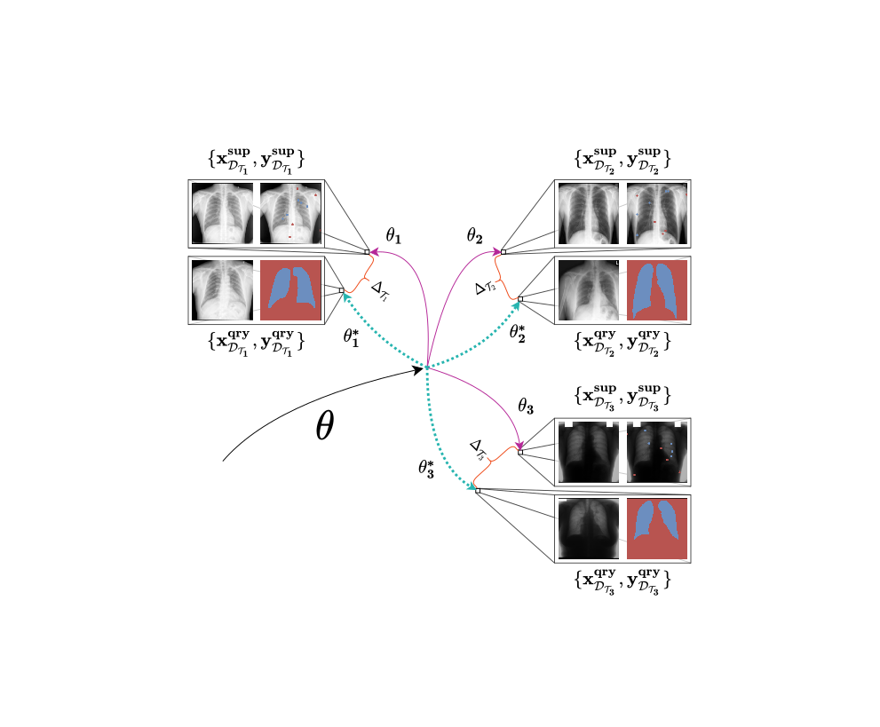

# Weakly Supervised Few-Shot Segmentation Via Meta-Learning - WeaSeL/ProtoSeg
WeaSeL (Weakly-supervised Segmentation Learning), is a method for few-shot semantic segmentation from sparse labels.
This repository included the implementation of the WeaSeL method and the ProtoSeg method. 

_We also included our implementation of the Guided Networks._

The paper where this method is presented was published in __

This is a **Pytorch** implementation.


> Visualization of WeaSel. In the inner loop, the parameters are optimized using sparse labels from support sets. The optimal weights would be obtained if dense labels were presented in meta-training, similar to the ones in the query set that are used to compute the task outer loss. The model learns to intrinsically minimize this difference Delta between parameters, and thus fastly adapt to the few-shot task.


## Instalation

### Pre-requisites
The following *requirements* are essential:
- python >= 3.5
- pytorch >= 1.5 && torchvision >= 0.6
- [torchmeta](https://github.com/tristandeleu/pytorch-meta) >= 1.5.3
- pillow >= 7.0
- scikit-image >= 0.17
- numpy >= 1.18
- scikit-learn >= 0.23

### Install
To install, simply clone this repository with `git clone https://github.com/pedrohtg/weasel.git`.

### Config
Adjust the configurations in the `config.ini` file, and eventually the class _ListDataset_ in the [list_dataset.py](data/list_dataset.py) file, if using different datasets.

## Datasets
Due to licensing we cannot provide direct acess to the medical datasets used, but mostly are publicly available upon request to owners.

The agricultural datasets, Brazilian Coffee and Orange Orchards, can be downloaded in this [link](http://patreo.dcc.ufmg.br/2022/03/23/brazilian-coffee-and-orange-datasets/).

## Train
With your datasets downloaded, and correctly setup (more info on [data](data)), set the default root path in the `list_dataset.py`.
Then check the configurations in `config.ini` file, lastly run the train script with:
```
python train_weasel.py
       train_protoseg.py
       train_guided.py
```

## Citation
If you use this code, please cite:
```
bibtex citation
```

#### Contact us
If you find any issues or have any problem let us know. You can open a new issue, or contact us via email:
- **Pedro Henrique Targino Gama** \([@pedrohtg](https://github.com/pedrohtg)\) : phtg [at] dcc<i></i>.ufmg.br 
- **Hugo Oliveira** \([@hugo-oliveira](https://github.com/hugo-oliveira)\) oliveirahugo [at] vision<i></i>.ime.usp.br 
