# Results

All Results from our paper "Weakly Supervised Few-Shot Segmentation Via Meta-Learning".

## Medical Results

### CRX Datasets

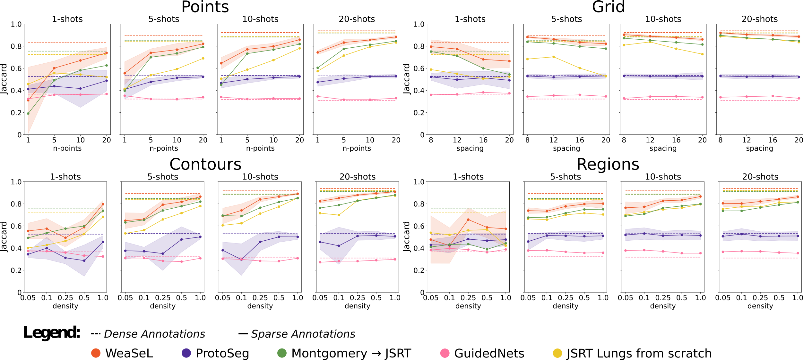
> Jaccard score of experiments with _JSRT Lungs_ task.

  

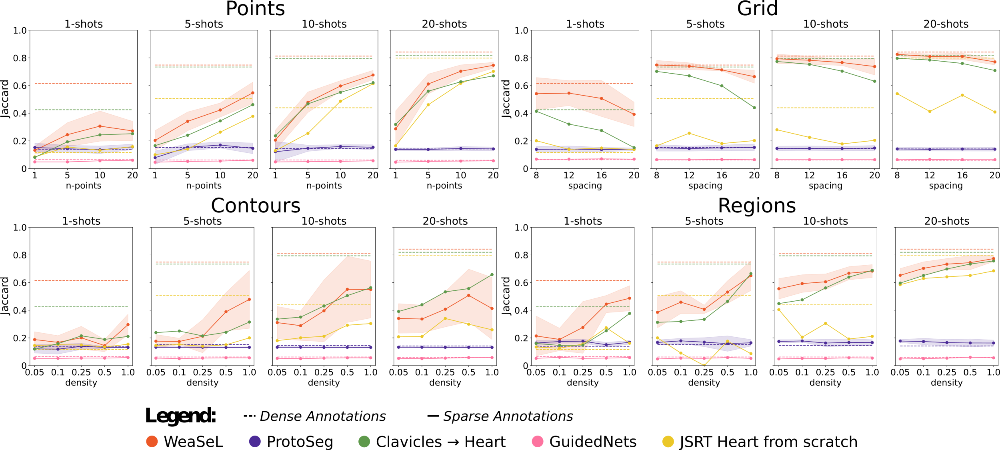
> Jaccard score of experiments with _JSRT Heart_ task.

  

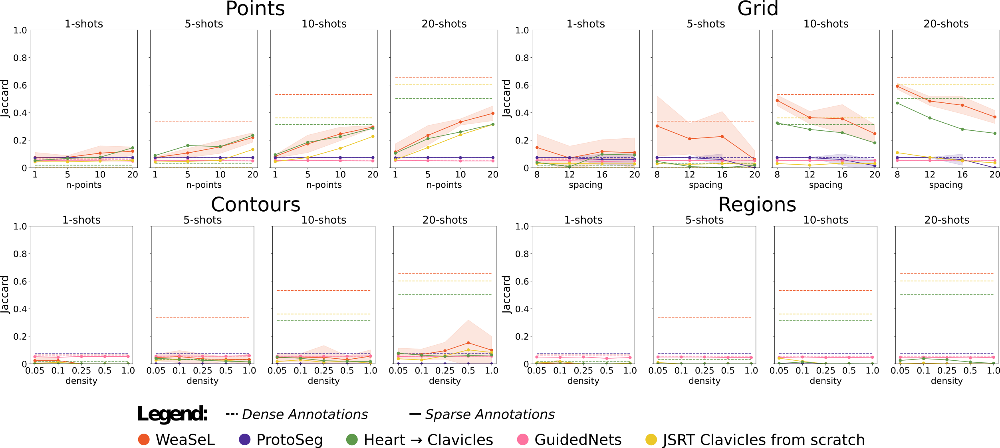
> Jaccard score of experiments with _JSRT Clavicles_ task.

  

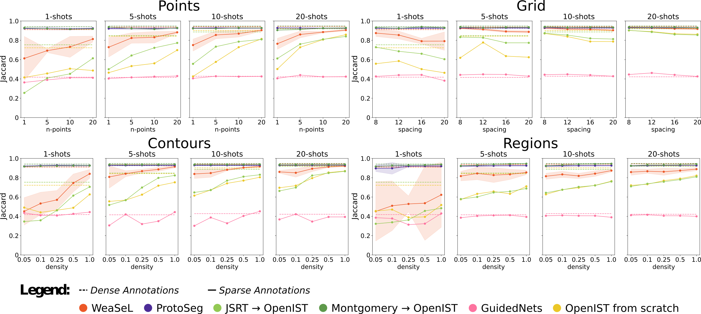
> Jaccard score of experiments with _OpenIST Lungs_ task.

  

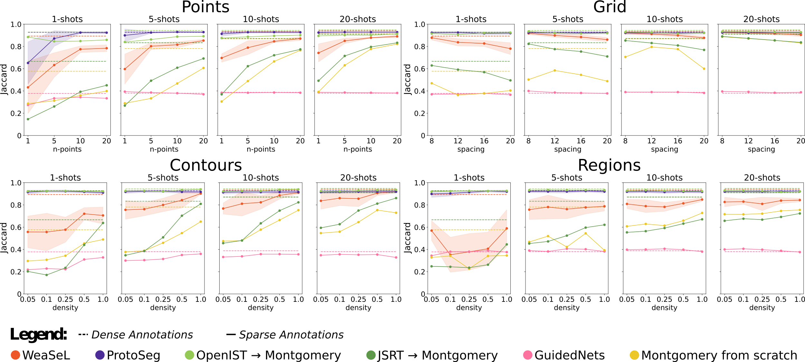
> Jaccard score of experiments with _Montgomery Lungs_ task.

  

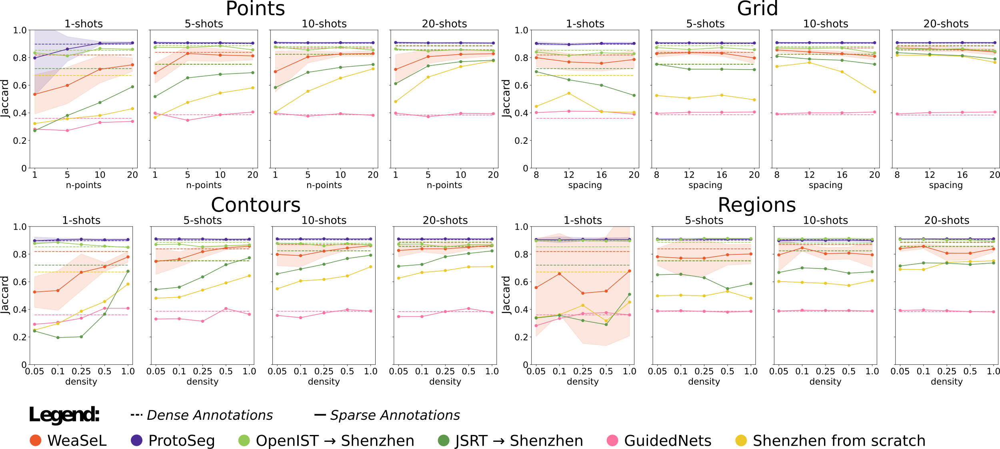
> Jaccard score of experiments with _Shenzhen Lungs_ task.

  

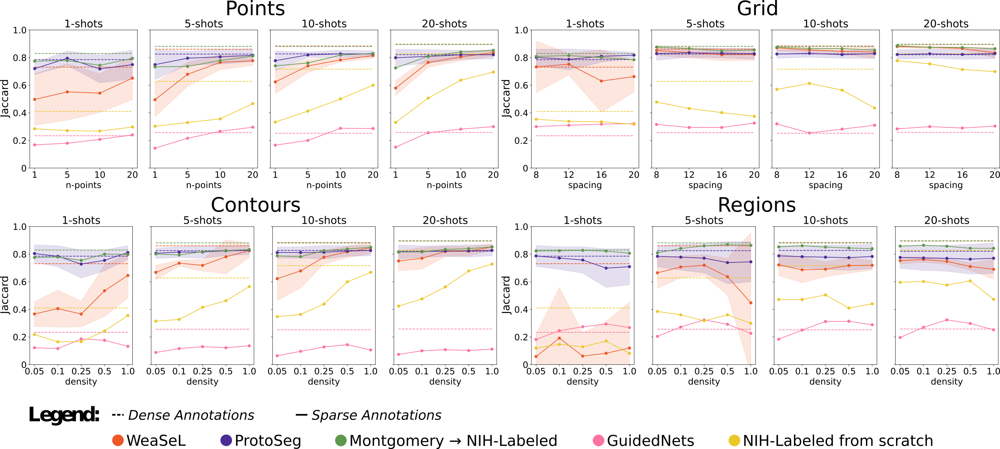
> Jaccard score of experiments with _NIH Labeled Lungs_ task.

  

### MXR Datasets

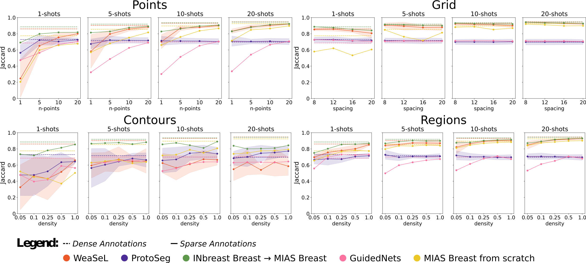
> Jaccard score of experiments with _MIAS Breast_ task.

  

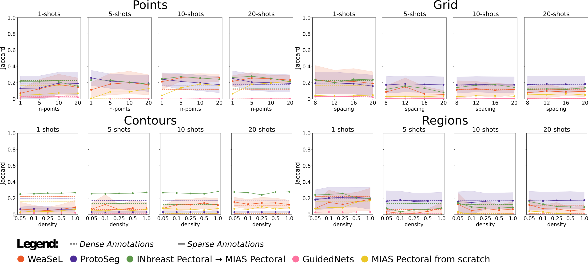
> Jaccard score of experiments with _MIAS Pectoral Muscle_ task.

  

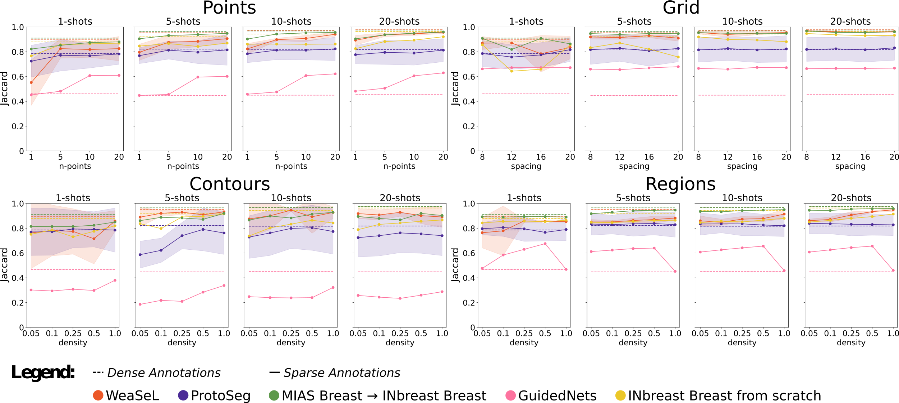
> Jaccard score of experiments with _MIAS Breast_ task.

  

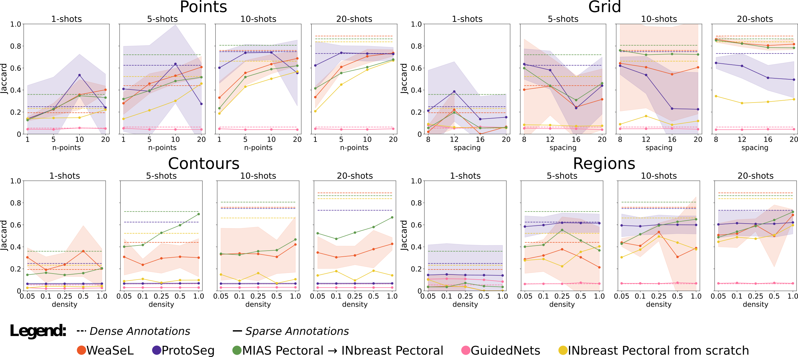
> Jaccard score of experiments with _INBreast Pectoral Muscle_ task.

  

### DXR Datasets

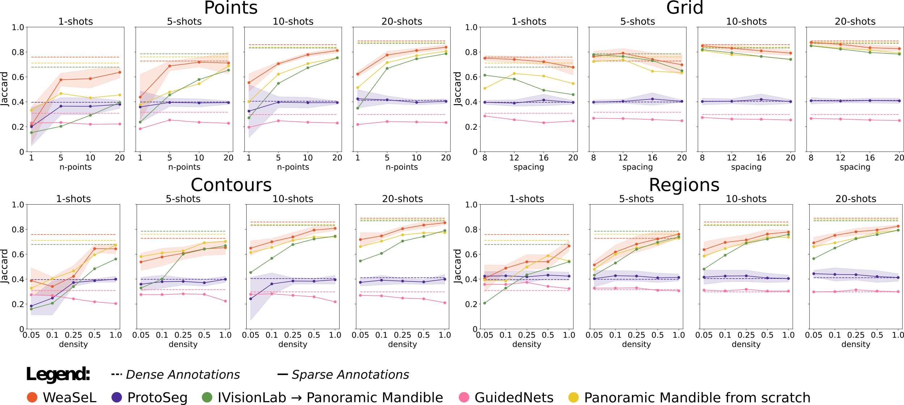
> Jaccard score of experiments with _Panoramic Mandible_ task.

  

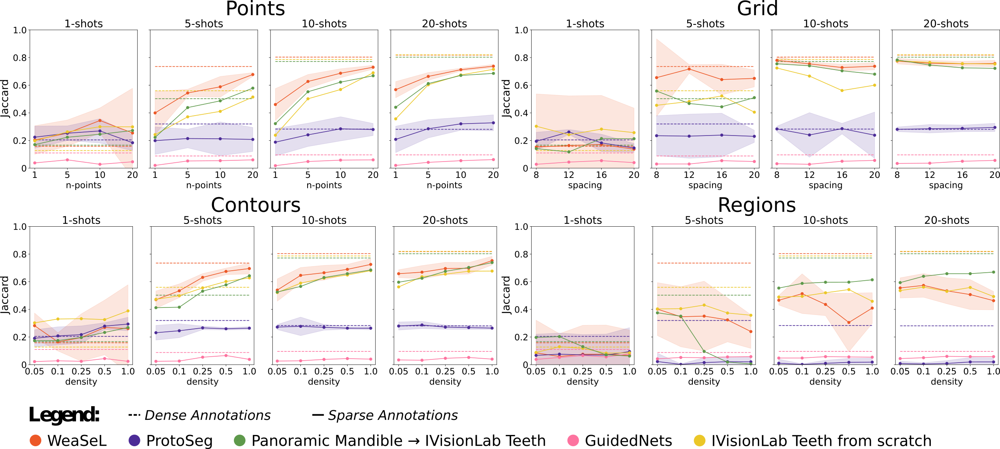
> Jaccard score of experiments with _IVisionLab Teeth_ task.

  

## Remote Sensing Results

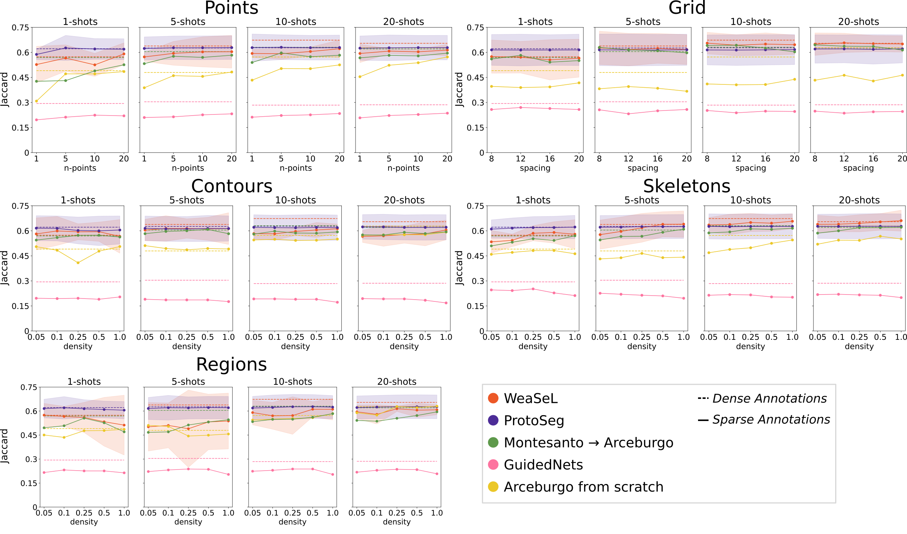
> Jaccard score of experiments with _Arceburgo Coffee_ task.

  

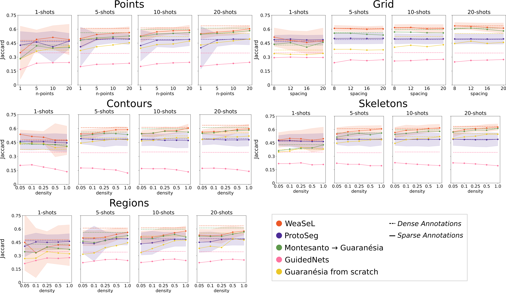
> Jaccard score of experiments with _Guaranésia Coffee_ task.

  

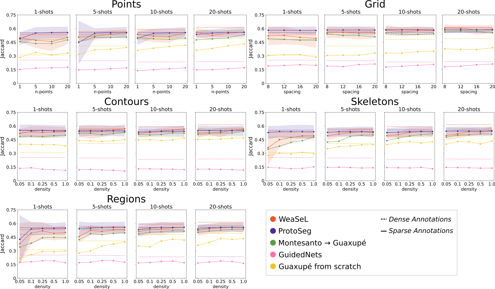
> Jaccard score of experiments with _Guaxupé Coffee_ task.

  

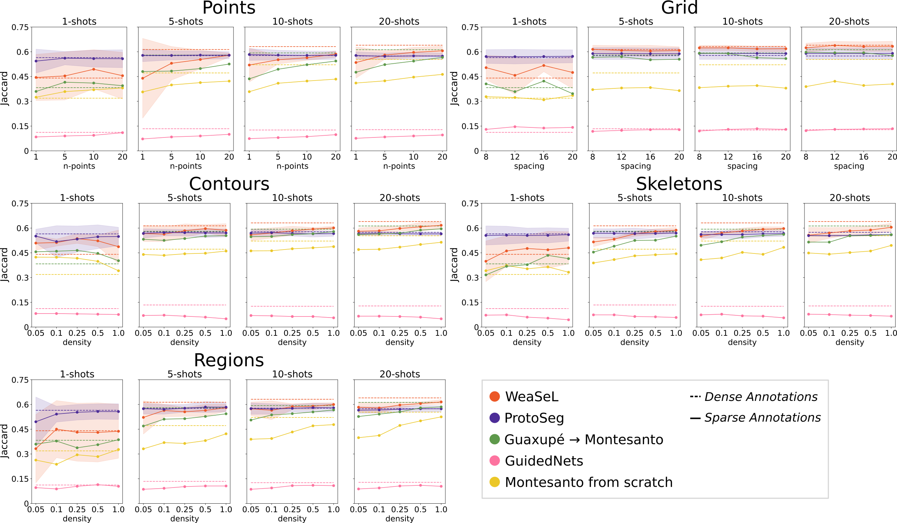
> Jaccard score of experiments with _Montesanto Coffee_ task.

  

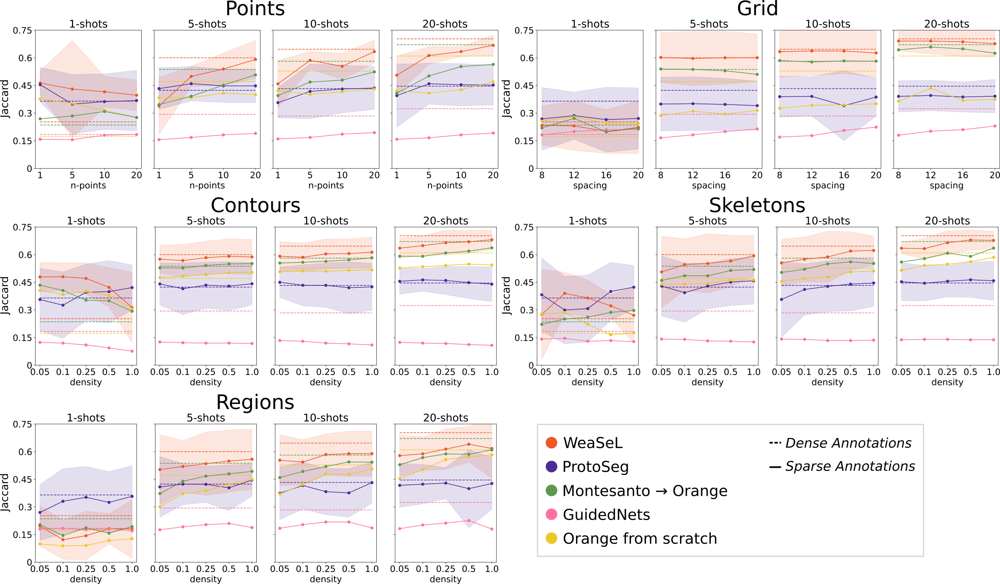
> Jaccard score of experiments with _Orange Orchard_ task.

  
